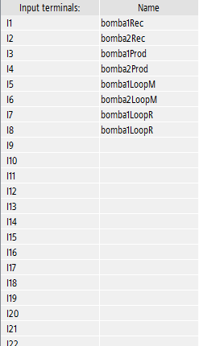
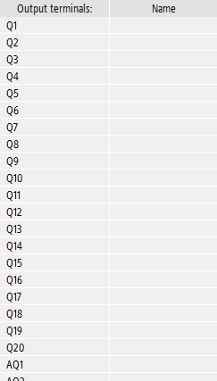

# Deltamed  
### Sistema de teste para osmose reversa

Esse sistema foi feito para testar o maquinario da Osmose da deltamed
## Recursos

1) PLC LOGO

Feito completamente focado na empresa DELTAMED, para suas funcionalidades necessarias para um controle local e a distancia
## Tech

 tecnologias usadas nos projetos:

- LOGO SOFT
## Entradas PLC

## Saidas PLC

